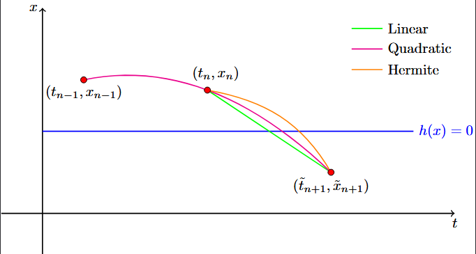
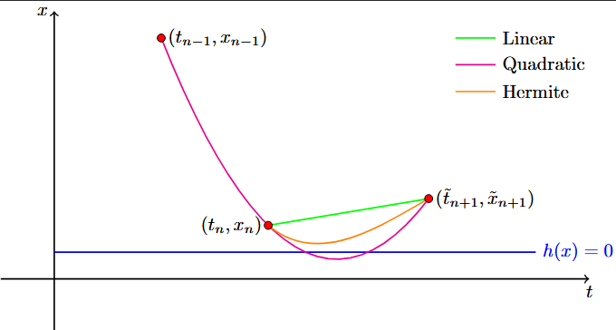

# List of Event Detection Methods

Our package utilizes two different options for event detection currently.

### Linear Interpolation Method (`Linear`)

The `Linear` event method simply uses simple linear sign changes between the states. If a crossing is found we estimate it via a secant line. Not the other methods below use this method first and then a stronger one if it fails. Linear works most of the time. 

### Linear/Quadratic Method (`LinearQuadratic`)

The `LinearQuadratic` method relies on historical trajectory data to approximate the guard functions behavior. It uses the previous accepted step, the current step, and the proposed next step to evaluate whether the guard function crossed zero. If a crossing is detected it will find the crossing using the False Position interpolation method. 

The method checks first for simple linear sign changes between the states. If the crossing is found we estimate it via a secant line: 

$$t_{\text{root}}=t_a - h_a \frac{t_b-t_a}{h_b-h_a}.$$

If no crossing is found it fits a parabola $h(t)=at^2 + bt+c$ to the three historical points by solving the system. 

$$\begin{bmatrix} t_{\text{prev}}^2 & t_{\text{prev}} & 1 \\ t_{\text{now}}^2 & t_{\text{now}} & 1 \\ t_{\text{next}}^2 & t_{\text{next}} & 1 \end{bmatrix} \begin{bmatrix} a \\ b \\ c \end{bmatrix} = \begin{bmatrix} h_{\text{prev}} \\ h_{\text{now}} \\ h_{\text{next}} \end{bmatrix}.$$

The algorithm then refines the crossing time using False Position interpolation between the left boundary $\tau_l$ and right boundary $\tau_r$:

$$\tau_m = \tau_r - h_r \frac{\tau_r - \tau_l}{h_r - h_l}.$$

### Linear/Hermite Method (`LinearHermite`)

The `LinearHermite` method requires only the current state and the proposed next state, but it utilizes the time derivatives of the guard function at those points to build a cubic Hermite polynomial. Similarly to the `LinearQuadratic` it first checks using Linear interpolation and uses Hermite if a crossing was detected and Linear couldn't find it. 

The time-derivative of the guard function is computed using the system's vector field:

$$h'(x) = \nabla h(x) \cdot \dot{x}.$$

Using $h_0, h'_0$ at $t_{\text{now}}$ and $h_1, h'_1$ at $t_{\text{next}}$, we construct a cubic Hermite polynomial parameterized by the offset $\tau \in [0, \Delta t]$:

$$p(\tau) = h_0 + h'_0 \tau + \alpha \tau^2 + \beta \tau^3.$$

Where the coefficients $\alpha$ and $\beta$ are defined as:

$$\alpha = \frac{3(h_1 - h_0) - (2h'_0 + h'_1)\Delta t}{\Delta t^2},$$

$$\beta = \frac{2(h_0 - h_1) + (h'_0 + h'_1)\Delta t}{\Delta t^3}.$$

The bracketing loop uses this Hermite cubic formulation. At each iteration, a Newton-Raphson solver steps towards the root of the local cubic approximation:

$$\tau_{k+1} = \tau_k - \frac{p(\tau_k)}{p'(\tau_k)}$$

The ODE solver takes a step to this intermediate time $\tau_m$, evaluates $h_m$, and updates the bracket and boundary derivatives to converge on the true crossing state and time.

### Example Images

Below are some examples on how the three (Linear, Quadratic, Hermite) interpolations work as well as an example where the Linear detection fails. 

Above is the example where interpolation works well for all methods.

Above is the example where Linear Interpolation would fail. 